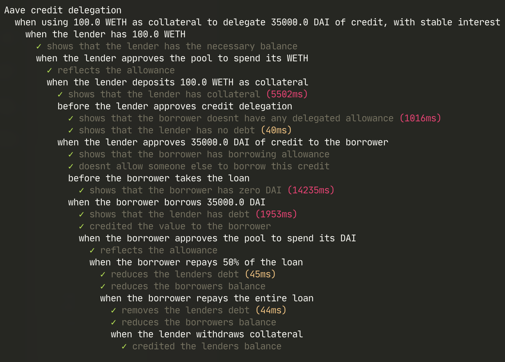
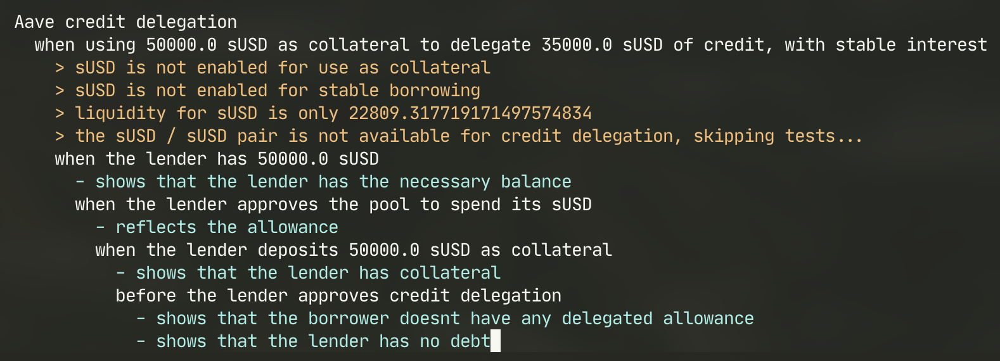

## Aave Credit Delegation

This project allows you to validate that a given collateral/loan pair can be used for credit delegation, provides instructions for performing the delegation via direct contract interaction, and provides some tools for simulating the delegation via forking.

### System overview

1. Owner deposits collateral in Aave via its LendingPool
2. Owner uses the data provider contract to retrieve the associated DebtToken for the borrower's desired asset to borrow
3. Owner interacts with the DebtToken contract to approve the borrower to take out a given amount of credit on the asset
4. Borrower borrows in Aave via its LendingPool increasing the Owner's `totalDebtETH`
5. Eventually, Borrower repays loan, decreasing the Owner's `totalDebtETH`
6. Eventually, Owner withdraws collateral from Aave

### Resources

##### Mainnet addresses:

- LendingPool: `0x7d2768dE32b0b80b7a3454c06BdAc94A69DDc7A9`
- DataProvider: `0x057835Ad21a177dbdd3090bB1CAE03EaCF78Fc6d`
- dsDAI: `0x778A13D3eeb110A4f7bb6529F99c000119a08E92`
- DAI: `0x6B175474E89094C44Da98b954EedeAC495271d0F`

##### Etherscan links

- LendingPool: https://etherscan.io/address/0x7d2768dE32b0b80b7a3454c06BdAc94A69DDc7A9#readProxyContract
- DataProvider: https://etherscan.io/address/0x057835Ad21a177dbdd3090bB1CAE03EaCF78Fc6d#readContract
- dsDAI: https://etherscan.io/address/0x778A13D3eeb110A4f7bb6529F99c000119a08E92#readProxyContract
- DAI: https://etherscan.io/address/0x6B175474E89094C44Da98b954EedeAC495271d0F

##### Aave documentation:

https://docs.aave.com/developers/v/2.0/the-core-protocol/lendingpool

### STEP BY STEP INSTRUCTIONS: Credit delegation on Mainnet via Etherscan

1. Verify the validity of the credit delegation parameters
   - Automated: as described in "Validating a credit delegation pair" using unit tests
   - Manually: In [app.aave.com](https://app.aave.com), make sure that the deposit asset is available for use as collateral, and that the borrow asset is available for stable/variable borrow, and has sufficient liquidity
2. Use [app.aave.com](https://app.aave.com) to deposit the desired collateral as `lender`
3. Use Etherescan for `DataProvider.getReserveTokensAddresses(asset: <address of the token to delegate>)` to identify the associated debt token
4. From the previous point, use `stableDebtTokenAddress` or `variableDebtTokenAddress` depending on your desired interest rate model, then click on the address to be able to interact with the contract via Etherscan
5. Use `DebtToken.approveDelegation(delegatee: <credit delegation beneficiary>, amount: <amount of credit to approve>)`. If the associated DebtToken doesn't have verified sources, or doesn't have its proxy properly set up in Etherscan, build a UI with oneclickdapp using interfaces from `artifacts/contracts/interfaces`
6. Use `DebtToken.borrowAllowance(fromUser: <lender>, toUser: <borrower>)` to verify that `borrow` has been approved for delegated credit
7. Use [app.aave.com](https://app.aave.com) to borrow as `borrower`

### Validating a credit delegation pair using unit tests on mainnet



Clone and install the repo

```
$ git clone clone git@github.com:ajsantander/aave-credit-delegation.git
$ cd aave-credit-delegation
$ npm install
```

Copy `.env.sample` to `.env` and specify your Infura private key, or Ethereum mainnet provider url. This will be used for forking mainnet and running simulations/checks against the fork.

To validate a pair, edit `test/CreditDelegation.test.js` to enter the desired collateral/loan pair, amounts, and interest model type, and then run the tests.

This will start a local fork of mainnet and simulate the credit delegation process with the specified parameters.

Edit `testPairs` in `test/CreditDelegation.test.js` with your desired parameters

Run `npm test`

If any test is skipped or fails, credit delegation may not be available for your desired parameters.


